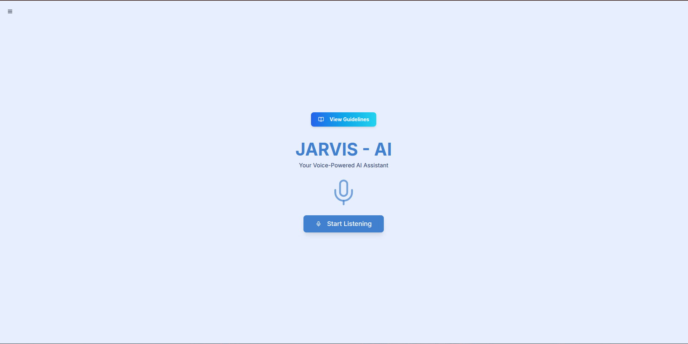

# Jarvis - Your Voice-Powered AI Assistant

<a href="https://jarvis-assist.netlify.app/guidelines" target="_blank" title="Guidelines to operate Jarvis - AI" style="display: inline-block; padding: 10px 20px; background-color: #87CEEB; color: white; text-align: center; text-decoration: none; border-radius: 5px; cursor: pointer;">
    Guidelines
</a>

## Description

Jarvis is a modern, voice-activated AI assistant built with Next.js and powered by Google's Gemini models through Genkit. It allows users to perform a variety of tasks using voice commands, such as generating document content, searching the web, drafting emails, finding locations on maps, and creating images. The application features a sleek, minimalist interface with real-time voice transcription and a history of interactions.

## Features

-   **Voice Input & Transcription**: Capture voice commands using the browser's Speech Recognition API and display real-time transcripts.
-   **Intent Recognition**: Processes natural language voice commands to understand user intent.
-   **Start/Stop Control**: Easily start and stop voice input capture with a prominent button.
-   **Microphone Animation**: Visual feedback with a pulsing microphone animation while listening.
-   **Google Doc Content Generation**: Generates text content on a given topic using AI, intended for use in Google Docs.
-   **YouTube Search**: Opens YouTube search results in a new tab based on voice commands.
-   **Email Composition Assistance**: Helps draft emails by taking recipient, subject, and intention, then generating a draft using AI. Opens a Gmail compose window.
-   **Google Maps Search**: Finds locations on Google Maps and opens results in a new tab.
-   **Open Website / General Web Search**: Opens Google search results for specified terms or websites.
-   **AI-Powered General Search**: Uses Gemini to answer questions and provide information directly within the app.
-   **Image Generation**: Creates images based on text prompts using Gemini's image generation capabilities.
-   **Command History**: Sidebar displays a history of user commands and Jarvis's actions, grouped by date.
-   **User Guidelines**: A dedicated page explains how to use various voice commands.
-   **Responsive Design**: UI adapts for a good experience on different screen sizes (though primarily designed for desktop).
-   **Theming**: Uses a light theme with specific primary, accent, and background colors.

## Technologies Used

-   **Frontend Framework**: Next.js (with App Router)
-   **UI Library**: React
-   **Styling**: Tailwind CSS
-   **UI Components**: ShadCN UI (radix-ui primitives, lucide-react for icons)
-   **State Management**: React Hooks (useState, useEffect, useContext, useMemo, useCallback)
-   **Forms**: React Hook Form with Zod for validation
-   **Client-side Routing**: Next.js
-   **Speech Recognition**: Browser's Web Speech API (`SpeechRecognition`)
-   **Speech Synthesis**: Browser's Web Speech API (`speechSynthesis`)

## AI Tools Used

-   **AI Orchestration & Backend**: [Genkit](https://firebase.google.com/docs/genkit)
    -   Used to define and manage AI flows that interact with language models.
-   **Language Models**: Google's [Gemini models](https://deepmind.google/technologies/gemini/) (specifically `gemini-2.0-flash` for text and `gemini-2.0-flash-exp` for image generation)
    -   Powers natural language understanding, content generation for documents, email drafts, general search queries, and image creation.

## Execution Flow

1.  **Voice Input**: The user clicks the "Start Listening" button on the main page.
2.  **Speech-to-Text**: The browser's Speech Recognition API captures the user's voice and transcribes it into text. Interim and final transcripts are processed.
3.  **Server Action**: The final transcript is sent to the `processVoiceCommand` server action (`src/app/actions.ts`).
4.  **Intent Determination**:
    *   `processVoiceCommand` uses a series of conditional checks (string matching, regular expressions) to determine the user's intent from the transcript (e.g., "generate document," "search YouTube," "compose email").
5.  **AI Flow Invocation (if applicable)**:
    *   For tasks requiring AI (document generation, email drafting, AI search, image generation), the server action calls the relevant Genkit flow defined in `src/ai/flows/`.
    *   These Genkit flows are configured to use Google's Gemini models via the `@genkit-ai/googleai` plugin.
    *   Input (e.g., topic, email intention, search query, image prompt) is passed to the flow.
    *   The Genkit flow communicates with the Gemini API and receives the generated text or image data.
6.  **Action Execution**:
    *   **AI Tasks**: The result from the Genkit flow (e.g., document content, email draft, search result, image data URI) is returned to the client.
    *   **Non-AI Tasks**:
        *   **YouTube/Maps/Web Search**: JavaScript on the client-side opens a new browser tab with the appropriate URL (e.g., `youtube.com/results?...`, `google.com/maps/search?...`).
7.  **UI Update & Feedback**:
    *   The main page (`src/app/page.tsx`) updates to display the results (e.g., generated text in a textarea, an image, a confirmation message).
    *   Text-to-speech (TTS) provides voice feedback to the user confirming actions or results.
    *   Toast notifications provide visual feedback.
8.  **History Logging**:
    *   The `addHistoryItem` function (provided via `PageInteractionContext` from `RootLayout`) is called to record the interaction (transcript, action type, query/topic/prompt).
    *   The `RootLayout` component updates its history state, which is persisted to `localStorage`.
    *   The `AppSidebar` component, receiving the updated history as props, re-renders to display the new entry in real-time.

## Future Scopes

-   **Enhanced Contextual Understanding**: Improve multi-turn conversation capabilities for more natural interactions.
-   **User Authentication & Personalization**:
    -   Allow users to log in.
    -   Store user preferences and history in a persistent database (e.g., Firestore) instead of `localStorage`.
    -   Personalize responses or suggestions based on user data.
-   **Deeper Google Workspace Integration**:
    -   Directly create and populate Google Docs via the Google Docs API.
    -   Send emails directly via the Gmail API after drafting.
    -   Calendar integration (viewing appointments, creating events).
-   **Tool/Plugin Extensibility**: Allow developers or users to easily add new capabilities or integrations with other services (e.g., music streaming, smart home).
-   **Custom Wake Word**: Implement a custom wake word (e.g., "Hey Jarvis") to activate listening instead of button clicks.
-   **Advanced Error Handling**: More granular error messages and suggestions for users.
-   **Offline Capabilities**: Limited functionality when offline (e.g., accessing cached history or basic commands if possible).
-   **Accessibility Improvements**: Further review and enhance ARIA attributes and keyboard navigation.
-   **Visual Polish**:
    -   More sophisticated animations.
    -   Theming options (e.g., dark mode toggle that works with the existing CSS variables).
-   **Mobile Application**: Develop a dedicated mobile application for on-the-go access.
-   **Testing**: Implement a comprehensive suite of unit and integration tests.
